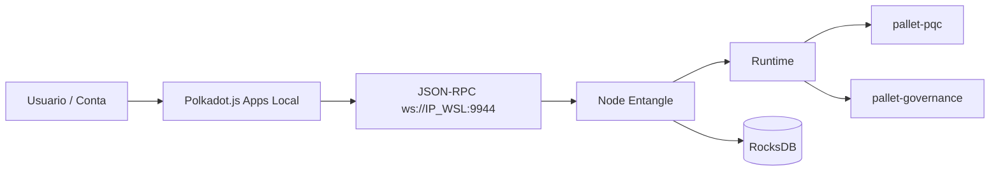

# Guia de Defesa TCC - Visao da Blockchain Entangle

Este arquivo resume a arquitetura e o discurso tecnico da solucao para apresentacao.

## 1. O que e o Entangle

Entangle e uma blockchain Layer 1 baseada em Substrate, com foco em criptografia pos-quantica (PQC):
- Assinatura hibrida no runtime (`Classic + ML-DSA`).
- Pallet `pqc` para registro/verificacao de chaves/assinaturas PQ.
- Pallet `governance` para proposta e votacao on-chain.

## 2. Arquitetura (alto nivel)

Ponto para banca:
- O frontend nao executa a logica de seguranca.
- A validacao relevante acontece no runtime (consenso + execucao on-chain).

## 3. Fluxo da demo (3 atos)

## 3.1 Ato 1 - Infra local
- Node sobe em `--dev` e produz blocos.
- Apps local conecta em `ws://IP_WSL:9944`.

Mensagem curta:
- "A rede local esta viva, produzindo blocos, sem dependencia externa."

## 3.2 Ato 2 - PQC
- `pqc.registerKeys` com chave ML-DSA.
- `pqc.verifySignature` com assinatura de teste.

Mensagem curta:
- "A verificacao ocorre no runtime, nao no browser."

## 3.3 Ato 3 - Governanca
- `governance.propose`
- `governance.vote`
- `governance.close` (ao vivo ou evidencia gravada, se janela de blocos for longa)

Mensagem curta:
- "A governanca ja roda com regras on-chain e eventos auditaveis."

## 4. Evidencias para mostrar na defesa

- Log do node com blocos importados.
- Tela do Apps conectada em endpoint local.
- Eventos de extrinsics (`KeysRegistered`, `SignatureVerified`, `Proposed`, `Voted`).
- Tabela de metricas (tamanho de chave/assinatura, peso de extrinsic, etc).

## 5. Desafios enfrentados e como foram resolvidos

1. Falhas de build WASM/runtime
- Resolvido ao respeitar a versao de Rust fixada no `rust-toolchain.toml`.

2. Erro de WebSocket 1006
- Resolvido com:
  - endpoint correto (`ws://IP_WSL:9944`),
  - `--rpc-external` no node,
  - regra de firewall para porta 9944.

3. Incompatibilidade de UI publica com tipos grandes
- Mitigado pela Opcao 2: Apps local mais atual (`yarn start`).
- Na pratica, em WSL usamos `yarn install --mode=skip-build` para contornar falha de modulos nativos opcionais de hardware, sem impactar o frontend web da demo.

## 5.1 Evidencia tecnica da Etapa 5 (Opcao 2)

- Apps local executando em:
  - `http://localhost:3000/`
  - `http://192.168.210.231:3000/`
- Node local executando em:
  - `ws://192.168.210.231:9944` (com `--rpc-external`)

Mensagem para banca:
- "Validamos a interface local mais atual para reduzir risco de incompatibilidade de tipagem da UI publica e garantir previsibilidade da demo em ambiente offline/local."

## 6. Limites atuais (honestidade tecnica)

- Ambiente de demo em `--dev` (nao e rede de producao).
- Algumas operacoes de governanca podem exigir janela de blocos longa para `close`.
- O foco do MVP e prova de funcionamento tecnico local, nao hardening de producao.

## 7. Frase de fechamento para o pitch

"Entregamos uma blockchain local funcional, com runtime Substrate, operacoes de governanca on-chain e integracao pos-quantica demonstravel de ponta a ponta, com trilha de reproducao tecnica e diagnostico documentados." 
